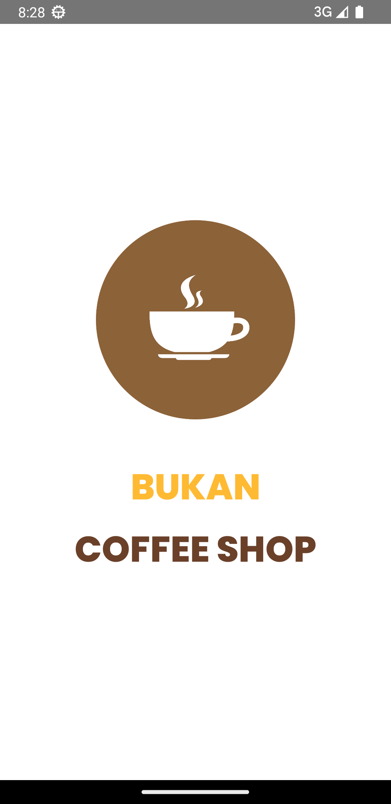
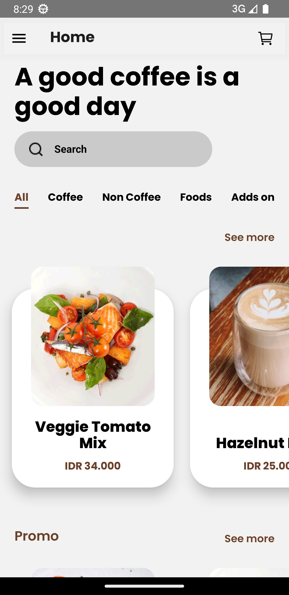
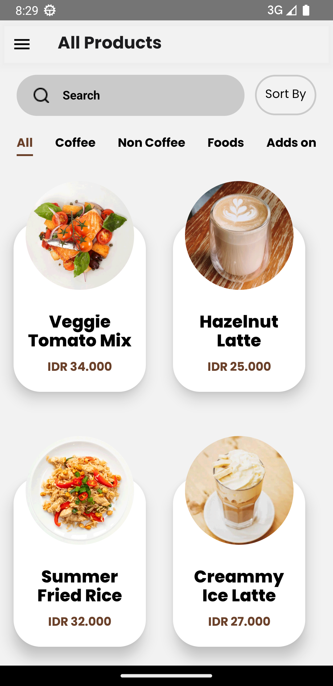
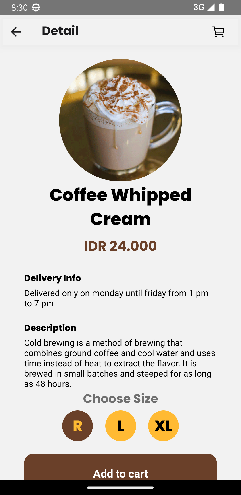
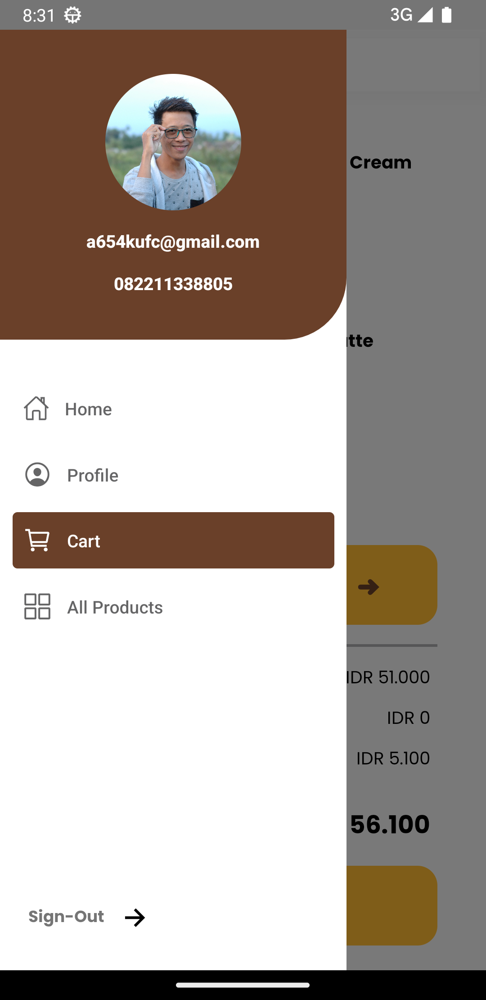
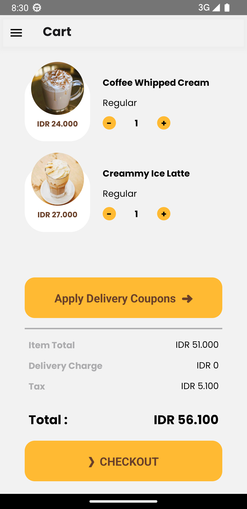
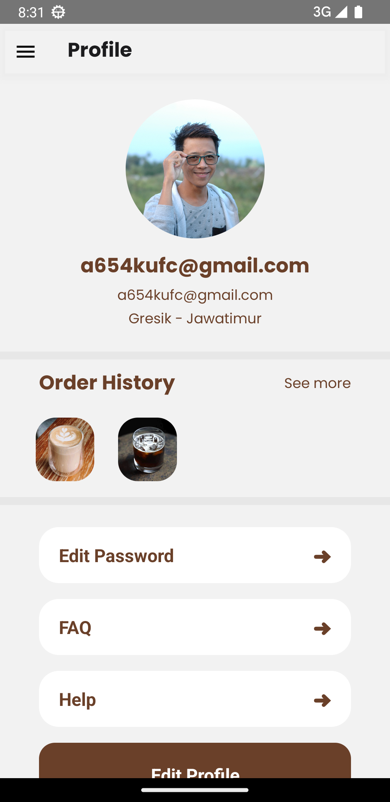
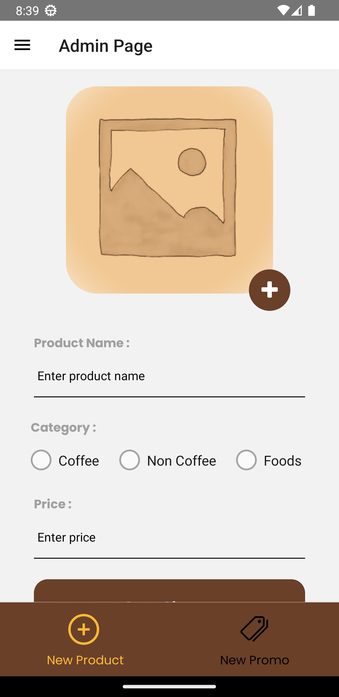

## Readme Top

<div align="center">

<h3 align="center">Bukan Coffe Shop</h3>

  <p align="center">
    <a href="https://drive.google.com/file/d/1oHRKyrKlOM7OarJf2z2f59Ir4IySjtiH/view?usp=share_link">View Demo</a>
    ·
    <a href="https://github.com/afif-buchori/coffee-andro/issues">Report Bug</a>
    ·
    <a href="https://github.com/afif-buchori/coffee-andro/pulls">Request Feature</a>
  </p>
</div>

<!-- TABLE OF CONTENTS -->
<!-- <details>
  <summary>Table of Contents</summary>
  <ol>
    <li>
      <a href="#about-the-project">About The Project</a>
      <ul>
        <li><a href="#built-with">Built With</a></li>
      </ul>
    </li>
    <li>
      <a href="#getting-started">Getting Started</a>
    </li>
    <li><a href="#Link-Download">Link Download</a></li>
    <li><a href="#usage">Usage</a></li>
    <li><a href="#contact">Contact</a></li>
    <li><a href="#acknowledgments">Acknowledgments</a></li>
    <li><a href="#Documentation">Documentation</a></li>
    <li><a href="#Contributor">Contributor</a></li>
  </ol>
</details> -->

<!-- ABOUT THE PROJECT -->

## About The Project

<!-- ![Product Name Screen Shot][product-screenshot] -->
<!--  -->

"Bukan Coffee Shop App is a mobile application built using React Native, designed to provide a seamless and user-friendly experience for coffee lovers. It offers a range of features including login, register, forgot password, edit profile, search products, add to cart, make transactions, view transaction history, create products, edit products, and delete products. The app aims to enhance the coffee ordering and purchasing process, making it convenient and enjoyable for users."

### Built With

<p align="center">
  <a href="https://skillicons.dev">
    
  </a>
</p>

<!-- GETTING STARTED -->

## Getting Started

### 1. Clone this repository

Clone this repository by run the following code:

```
$ git clone https://github.com/afif-buchori/coffee-andro

```

### 2. Install dependency packages

Install dependency packages by run the following code inside project folder:

```
$ npm install
```

### 3. Configure .env file

Configure .env file by create file named .env inside project folder and add this line to the file:

```
SERVER_HOST = https://example.com

```

### 4. Running app

1.  Start Metro

    ```
    npx react-native start
    ```

2.  Start app

    ```
    npx react-native run-android
    ```

## Link Download

[Download APP](https://drive.google.com/file/d/1oHRKyrKlOM7OarJf2z2f59Ir4IySjtiH/view?usp=share_link)

<!-- USAGE EXAMPLES -->

<!-- CONTACT -->

## Contact

Muchamad Afif Buchori - 4fifbuchori@gmail.com

Project Link: [https://github.com/redhadefinto/coffe_shop_fe](https://github.com/redhadefinto/coffe_shop_fe)

## Documentation

<!-- 


 -->
<!-- <p>DEVELOPMENT</p> -->
<div>




</div>
<div>




</div>

<p align="right">(<a href="#readme-top">back to top</a>)</p>

<!-- Contributor -->

<!-- ## Contributor

  <table>
    <tr>
      <td >
        <a href="https://github.com/afif-buchori">
          <br/>
          <center><sub><b>M. Afif Buchori</b></sub></center>
        </a>
        </td>
    </tr>
  </table>
<h1 align="center"> THANK FOR YOUR ATTENTION </h1> -->

<!-- MARKDOWN LINKS & IMAGES -->
<!-- https://www.markdownguide.org/basic-syntax/#reference-style-links -->

<!-- [product-screenshot]: index.png -->

<!-- [Next.js]: https://img.shields.io/badge/next.js-000000?style=for-the-badge&logo=nextdotjs&logoColor=white
[Next-url]: https://nextjs.org/
[React.js]: https://img.shields.io/badge/React-20232A?style=for-the-badge&logo=react&logoColor=61DAFB
[React-url]: https://reactnative.dev/
[Redux]: https://img.shields.io/badge/redux-%23593d88.svg?style=for-the-badge&logo=redux&logoColor=white
[Redux-url]: https://redux.js.org/ -->
